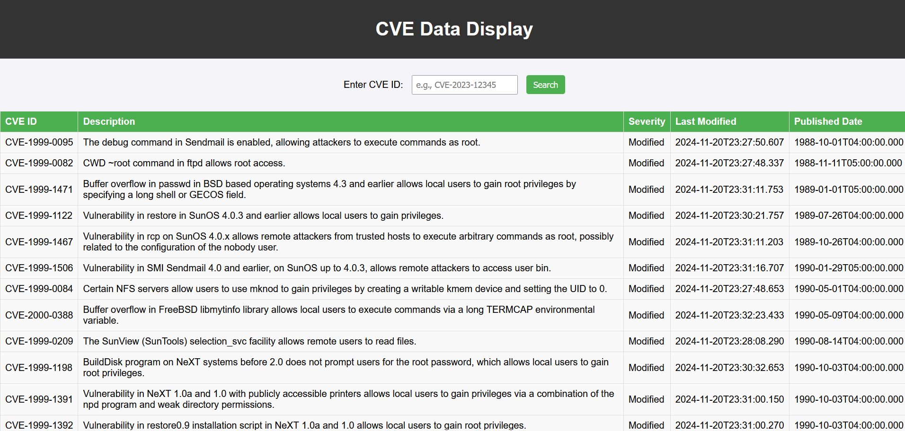
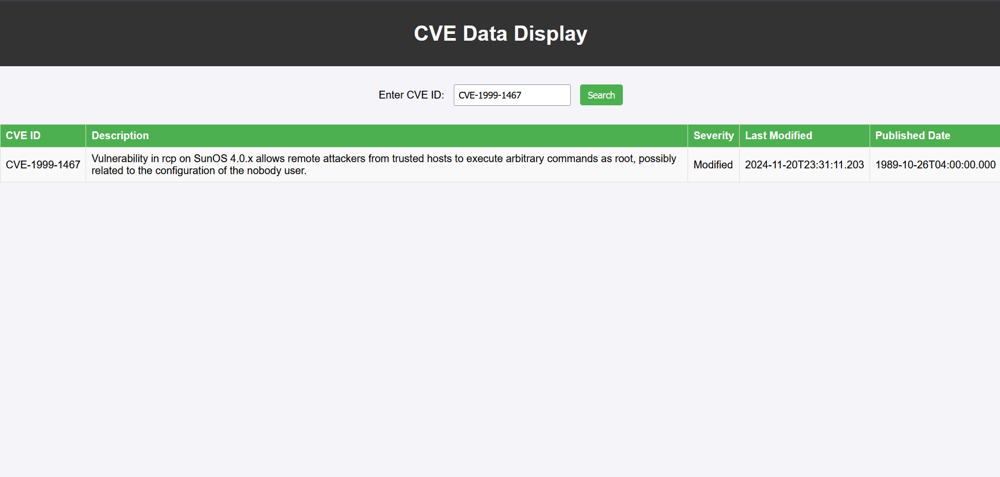
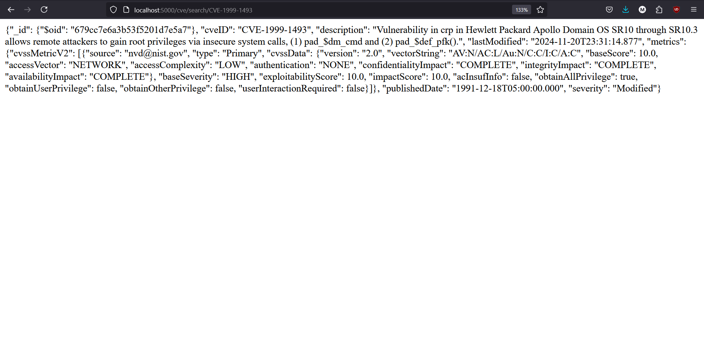

# Securin

Overview

This project is a Flask-based web application that interacts with a MongoDB database to store and retrieve CVE (Common Vulnerabilities and Exposures) data. It provides pagination and search functionality for retrieving CVE details.

This projects consists of two files, app.py and index.html. The app.py handles the backend of the project including fetching the data from the api. The index.html provides the frontend.

Screen shots
1) Display Screen

This is the display when the index.htlm is opened. This shows all the data available in the database with 15 entries on each page.
This also has a search box that allows the user to search for a specific CVE using its ID.  

2) Search Result 

This is the result when the user searches a specific CVE using its ID. If the CVE ID is not a valid one then an error message is thrown. 

3) Backend
   

   This is the Backend response for a CVE ID query.

NOTE: 1) The database was populated and stored locally so if the code were to run elsewhere, the database has to be downloaded locally.  
      2) The option of viewing a specific CVE from the display screen was not implemented.  
      3) The search feature was implemented.  

